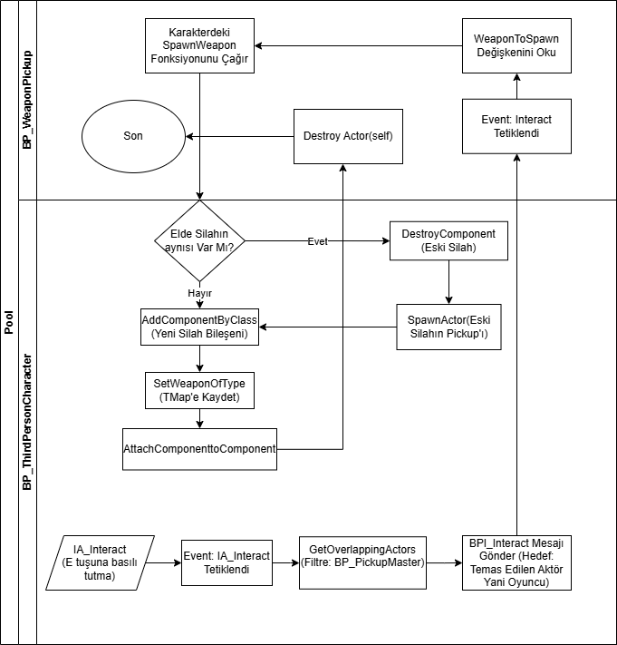

# Unreal Engine 5 - Third Person Shooter Projesi
*Kocaeli Üniversitesi/Yazılım Geliştirme Laboratuvarı I dersi kapsamında geliştirilmiştir.*
# Oyunun Hikayesi ve Seviye Tasarımı:
*Oyunda oyuncuyu yönlendirmek ve atmosferi geliştirebilmek amacıyla diyalog ve trigger kullanımında başvurulmuştur.*
*Oyun başlangıcında beyaz bir ekran ve kulak çınlama efektiyle karakteri görürüz ve "oradaki bizimkilerden mi" diyalogu oynar.* Oyuncu, yerde yatan kendi üniformasına sahip cesede yaklaşınca bir not görür, yerden alır ve notta şu yazılıdır: "köprüyü sakın geçme".*
*Oyuncu eğer köprüden geçerse bir patlama efekti ile birlikte ölür.*Oyuncu köprünün etrafından dolanarak merkez bölgeye girerse yerde birkaç kanlı ceset görür ve yerdeki bedenlerin biriyle etkileşime girmesinin ardından "kanlar hala taze" diyalogu oynar.*
*Etkileşimin triggerlanmasından yaklaşık 5 saniye sonra yakındaki küçük bir düşman npc kampından sesler gelmeye başlar.*Oyuncu, gelen sesi takip ederek dğşmanları bulur ve temizler.* Ardından düşman kampından yeni bir not alır, bu notta "yolun sonundaki değirmenin    arkasındayız, elinizi çabuk tutun" yazıyordur.* *Oyuncu, değirmenin arkasında düşmanlar olduğunu anlayarak değirmenin arkasına doğru yol alır.* *Yolun üzerinde yine haritadan materyallerle donatılmış dikkat çekici bir bölge ve bu bölgede karakterin ve de düşman npc lerin bölgeye geliş amacı olan "Ezel Taşı"nın özellikleri yazan bir not bulur: "Ezel Taşı'na sahip olan zamanın ve mekanın efendisi olur.* *Kimi efendi geleceği kendi çıkarları için düzenler, kimi ise geçmiş pişmanlıklarını.* *Ancak Ezel Taşı'nı kullanmanın bedeli anılardır.* *Her kullanımda anıların, sonunda benliğinin silinmesine yol açar."* *Karakter değirmene doğru devam edip yaklaşınca  önce "ekibin kalanını hallettik ama bizimkiler nerede kaldı?" diyalogu oynar ve ardından düşmanlar oyuncuyu görünce oyuncu karakteri diyalogu oynar: "hepsini halletmediniz!"* *Oyuncu o son düşmanları da temizler.* Düşmanları temizledikten sonra buraya asıl geliş amacı Ezel Taşını onlardan alır, taşı aldıktan sonra portal aktive olur ve "gitme zamanı geldi" diyaloğu girer.* *Oyuncu portala girince yine bir beyaz ekran girer ve önce "sonunda annemi tekar görebileceğim" diyolağu ardından "tebrikler, Ezel taşını buldunuz." widget'ı ile oyun biter.*

